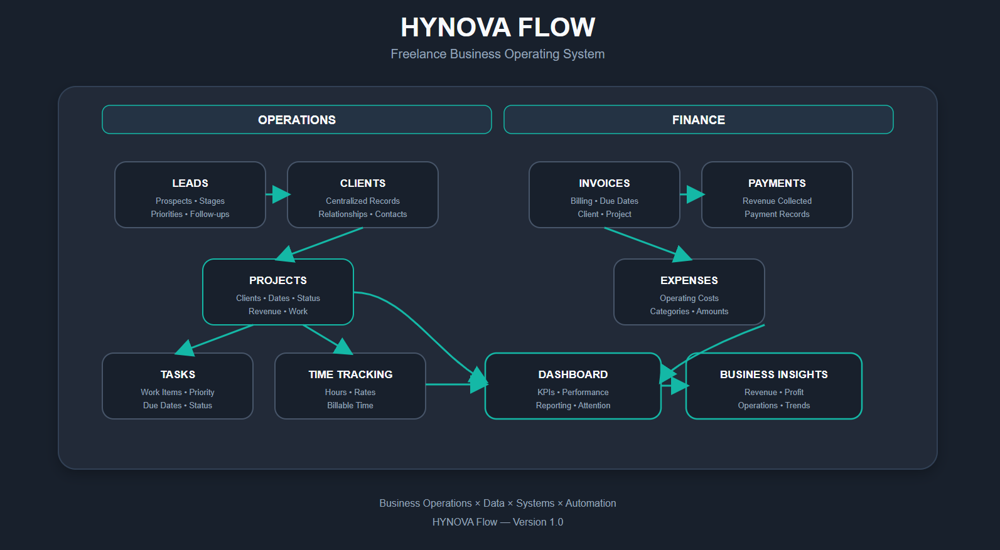
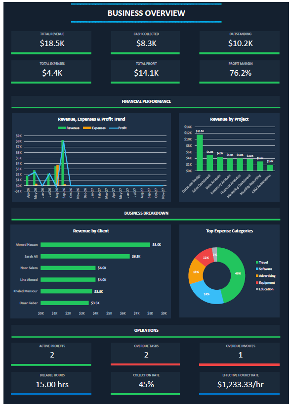
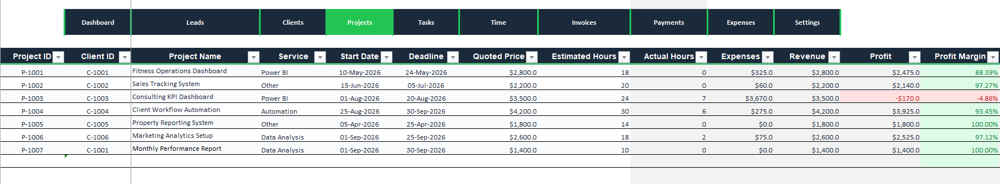

# HYNOVA Flow

## Freelance Business Operating System

HYNOVA Flow is an end-to-end business operations system built in Microsoft Excel for freelancers and solo service providers.

It brings leads, clients, projects, tasks, time tracking, invoicing, payments, expenses, follow-ups, and reporting into one connected workflow.

The goal is simple:

> Turn scattered business information into one organized, measurable system.

---

## The Business Workflow

```text
Lead
  ↓
Client
  ↓
Project
  ↓
Tasks
  ↓
Time Tracking
  ↓
Invoice
  ↓
Payment
  ↓
Expenses
  ↓
Reporting
```

---

HYNOVA Flow connects these stages so that information can move through the business without relying on disconnected spreadsheets or separate manual trackers.

# Key Features


## Lead Management

Track potential clients from initial contact through conversion.

- Lead information
- Service requirements
- Lead stage
- Priority
- Follow-up dates
- Lead status
- Follow-up visibility


## Client Management

Maintain a centralized record of clients and their business information.

- Client records
- Contact information
- Client identifiers
- Project relationships
- Financial relationships


## Project Management

Organize client work and monitor project performance.

- Project information
- Client relationships
- Start and end dates
- Project status
- Project revenue
- Project tracking
- Task relationships


## Task & Time Tracking

Track the operational work required to complete projects.

- Tasks
- Priorities
- Due dates
- Task status
- Time records
- Billable time
- Billable amounts


## Financial Management

Track the financial side of the business.

- Invoices
- Invoice status
- Payments
- Outstanding amounts
- Expenses
- Revenue
- Profit


## Business Dashboard

Transform operational data into business-level visibility.

The dashboard provides visibility into:

- Revenue
- Expenses
- Profit
- Project performance
- Expense categories
- Operational attention items
- Follow-ups
- Financial activity


## Workflow Automation

VBA automation is used to reduce repetitive administrative work.

Automation includes areas such as:

- Workbook maintenance
- Formula management
- Data processing
- Dashboard refresh workflows
- Structured table management
- Operational maintenance


# System Architecture

The system is structured around connected business entities rather than isolated spreadsheets.



# Screenshots


## Dashboard

The dashboard provides a high-level view of business performance and operational activity.



## Lead Management

The lead management system tracks prospects, stages, priorities, and follow-up activity.


## Project Management

Projects connect clients with operational work, dates, financial information, and tasks.



## Invoice Management

Invoices provide visibility into billed amounts, due dates, clients, projects, and payment status.


## Expense Management

Expenses are categorized and connected to the financial reporting layer.


# Technology

HYNOVA Flow was developed using:

- Microsoft Excel
- Excel Tables
- Advanced Excel formulas
- VBA
- PivotTables
- Dashboard design
- Data modeling
- Workflow design
- Business process mapping
- Financial tracking
- Reporting automation


## Compatibility

Designed for:

**Microsoft Excel 2016 and later**

The system does not rely on newer dynamic-array functions such as `FILTER` or `XLOOKUP`.

# System Design

The system was designed around several principles.

## 1. Centralized Information

Business information should have a clear place to live.

## 2. Connected Data

Clients, projects, tasks, invoices, payments, and expenses should be connected through consistent identifiers.

## 3. Reduced Manual Work

Repeated calculations and administrative processes should be automated where practical.

## 4. Visibility

Raw business records should be transformed into useful operational and financial information.

## 5. Scalability

The structure should allow additional records and future automation without redesigning the entire system.

# My Role

I designed and developed HYNOVA Flow from the ground up.

This included:

- Business workflow design
- System architecture
- Data structure
- Table relationships
- Excel formulas
- VBA automation
- Dashboard development
- Financial tracking
- Operational tracking
- Follow-up logic
- Reporting structure
- User onboarding
- Documentation

The project required translating a real freelance business workflow into a structured operational system.

# What This Project Demonstrates

HYNOVA Flow demonstrates practical experience in:

- Business Systems Design
- Business Process Improvement
- Business Operations
- Data Modeling
- Microsoft Excel
- VBA
- Workflow Automation
- Dashboard Development
- Financial Reporting
- Project Management
- Process Mapping
- Data Management
- Operational Reporting


# Project Purpose

HYNOVA Flow was built as both a practical business system and a demonstration of how business operations can be structured using familiar tools.

The project sits at the intersection of:

**Business Operations × Data × Systems × Automation**

Rather than treating Excel as a simple spreadsheet, the project uses it as a structured business application.

# Project Status

**Completed — Version 1.0**

Future development can extend the system toward:

- External API integrations
- Automated notifications
- CRM integrations
- Advanced reporting
- Workflow automation
- Database-backed architecture
- n8n integrations
- AI-assisted workflows


# Commercial Product

The commercial version of HYNOVA Flow is distributed separately.

The public repository is intended as a portfolio case study and documentation repository.

The commercial workbook and proprietary VBA implementation are not included in this repository.

# Repository Structure

```text
HYNOVA-Flow/
│
├── README.md
│
├── screenshots/
│   ├── dashboard.png
│   ├── leads.png
│   ├── projects.png
│   ├── invoices.png
│   └── expenses.png
│
├── documentation/
│   ├── system-overview.md
│   ├── data-model.md
│   └── workflow.md
│
├── demo/
│   └── sample-data.xlsx
│
└── assets/
    └── architecture.png
```


## Product

HYNOVA Flow is available as a commercial digital product.

## [Product Link](https://hynova20.gumroad.com/l/flow)

## License

This repository contains the public case study and documentation for HYNOVA Flow.

### The commercial workbook itself is not included in this repository.

# HYNOVA

HYNOVA focuses on practical systems, data, automation, and operational solutions designed to make businesses easier to run.

## Build better systems. Run better businesses.

